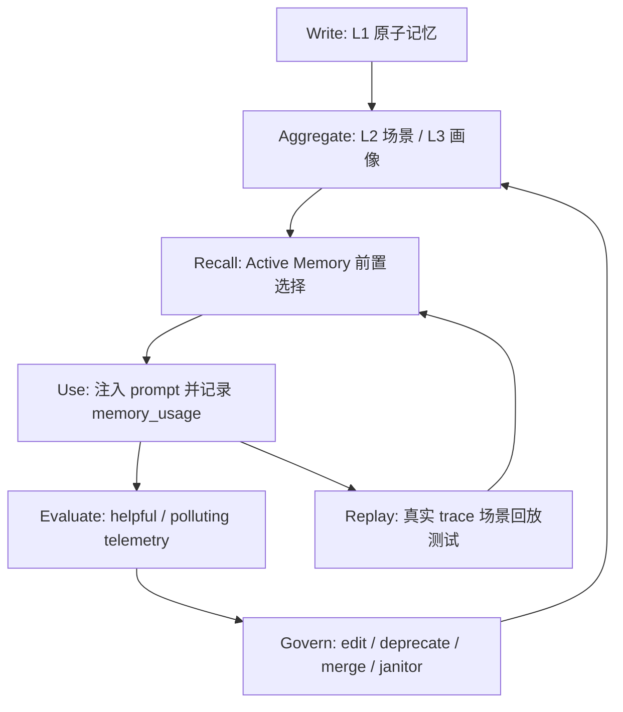

# Agent 记忆不是 RAG：我们如何把长期记忆做成一个受控系统

如果你在做 AI Agent，很可能已经实现过“记忆”：

- 把用户偏好写进数据库。
- 下次对话前搜索几条相关内容。
- 塞进 system prompt。
- 希望模型“自然使用这些信息”。

这套方案在 demo 里很好看，在真实产品里会逐渐变成事故源。

因为 Agent 的记忆不是普通知识库。普通知识库错了，最多检索结果差一点；Agent 记忆错了，会进入决策上下文，变成模型行动的依据。它会让 Agent 选错工具、套错偏好、复现旧 bug、甚至在用户已经纠正之后继续相信旧事实。

我们最近连续处理了几轮真实 trace，最后得到一个结论：

> 顶尖 Agent 记忆系统的目标，不是“记得更多”，而是“只在正确场景想起正确记忆，并且错误记忆会被系统自动治理”。

这篇文章不是概念介绍，而是一次工程复盘。它讲的是我们如何把 AgentClaw 的记忆从“能存能搜”推进到“可召回、可治理、可审计、可回放、可自动清理”的受控系统。

---

## 一、记忆系统真正的失败方式

很多团队会把记忆问题理解成召回问题：搜不准、embedding 不好、top-k 不合适。

这些当然重要，但真实 Agent 里更致命的是下面几类失败。

### 1. 旧偏好污染新任务

用户曾经说过：

> PPTX 喜欢暗色科技风。

后来用户让 Agent 做招商、赞助、商业合作类 PPT。

如果系统把“暗色科技风”当成强规则，Agent 就会继续生成暗色 deck。对模型来说它没错，它只是在执行记忆；对用户来说这就是低级事故。

问题不在模型，而在系统没有区分：

- 稳定身份信息。
- 场景偏好。
- 一次性任务偏好。
- 可选视觉参考。
- 当前任务的明确要求。

### 2. 同一会话里，第二轮丢了任务语境

真实 trace 里出现过这样的对话：

第一轮：

> 做 PPTX 交付第一步是什么？

第二轮：

> 同一会话继续，最终应该交付什么文件？

第二句话没有出现 “PPTX”。如果 Active Memory 只看当前一句，就可能召回一些共享关键词相似、但任务完全无关的记忆，例如“用户喜欢川菜”。

这听起来荒唐，但真实系统里很常见。因为 trace id、测试词、时间词、用户称呼等弱相关 token 会把无关记忆抬进候选集。

### 3. 记忆写错后，没有退出机制

记忆一旦写入，如果只支持搜索和注入，不支持治理，它就会长期污染。

典型表现：

- 用户纠正过，但旧记忆仍在。
- 两条冲突偏好同时进入 prompt。
- 错误记忆被多次召回，越用越像“稳定事实”。
- 记忆内容被编辑了，但 embedding 还是旧内容，搜索仍按旧语义召回。

### 4. 修复只停留在 prompt

Agent 工程里最危险的一句话是：

> 以后注意。

如果一次事故只靠改提示词解决，下次用户换个表达，很可能重新发生。

我们最终把这条原则写进了工程纪律：

> 能力层问题修复后，必须把真实 trace 抽象成场景回放测试。测试不能只覆盖开发者想象路径，必须覆盖用户真实表达、原会话上下文、记忆影响、工具副作用、最终用户可见结果。

这句话是整个记忆系统升级的分水岭。

---

## 二、我们的目标：把记忆从“资料堆”变成“控制系统”

我们重新定义了 Agent 记忆系统的四个目标。

| 目标 | 错误做法 | 正确做法 |
|---|---|---|
| 想得起 | top-k 搜一堆塞进 prompt | 按当前任务和最近上下文选择少量 Active Memory |
| 想得准 | 只靠 embedding 相似度 | 结合层级、场景、任务类型、确定性排序和模型选择 |
| 错了能改 | 人手删除数据库 | 编辑、废弃、合并、替代都有 API 和测试 |
| 不再复发 | 改 prompt 后相信模型 | 真实 trace 变成默认测试链里的场景回放 |

注意，这里没有“调参面板”。

对 Agent 系统来说，调参面板最多是内部诊断工具，不应该是主方向。用户不该知道 top-k、query mode、threshold。系统应该自己做判断，并且在判断错的时候留下证据、触发治理、进入回归测试。

---

## 三、架构总览：五层记忆闭环

我们最终形成了五层闭环。



这套结构的关键点是：每条记忆都不是“写进去就完了”。它会经历写入、聚合、召回、使用、评估、治理、回放。

也就是说，记忆不只是 storage，而是一个持续收敛的系统。

---

## 四、L1 / L2 / L3：先给记忆分层

我们把长期记忆分成三层。

| 层级 | 含义 | 例子 | 作用 |
|---|---|---|---|
| L1 | 原子记忆 | “用户要求 PPTX 最终必须发送 pptx 文件” | 作为证据来源 |
| L2 | 场景聚合 | “PPTX delivery 场景：先预览，确认后发送最终 pptx” | 任务场景召回 |
| L3 | 稳定画像 | “用户偏好直接、少废话、真实验收” | 跨场景稳定偏好 |

为什么要分层？

因为直接把 L1 全塞进 prompt 会很吵。L1 是事实碎片，适合追溯；L2 是场景规则，适合任务召回；L3 是稳定画像，适合长期个性化。

一个高质量 Agent 记忆系统应该优先召回 L2/L3，而不是让几十条 L1 碎片挤进上下文。

同时，每条聚合记忆必须保留证据链：

```json
{
  "layer": "L2",
  "source": "scene_aggregate",
  "sceneName": "PPTX delivery",
  "sourceMemoryIds": ["m1", "m2", "m3"],
  "confidence": 0.95
}
```

这解决了一个常见问题：当 Agent 使用某条“总结出来的记忆”时，我们能追溯它来自哪些原始事实。

---

## 五、Active Memory：不是搜索 top-k，而是任务前置选择

传统做法是：

1. 拿当前用户输入做 search。
2. 取 top-k。
3. 拼进 prompt。

这会把“看起来相关”的东西塞进去，却不保证“对当前任务有用”。

我们改成了 Active Memory：

1. 先搜索出候选记忆。
2. 用确定性规则做 ranking 和 shortlist。
3. 让 provider-backed selector 从 shortlist 里选出最多 5 条真正有用的记忆。
4. selector 失败或空输出时，不退回全量注入，而是走确定性 fallback。

伪代码大概是：

```ts
const ranked = rankActiveMemoryCandidates(query, candidates);
const deterministicSelection = ranked
  .filter((item) => item.score >= 0.12)
  .slice(0, 5);

const selected = await providerSelect({
  request: query,
  candidates: ranked.slice(0, 8),
});

return selected.ok ? selected.memories : deterministicSelection;
```

这里最重要的是最后一句：**selector 失败不能退回全量注入**。

因为 selector 失败时，最危险的做法就是把全部记忆塞回 prompt。那等于在系统最不确定的时候扩大污染面。

我们真实遇到过 MiMo 模型在 selector 阶段输出为空或被 max_tokens 截断。修复后，空输出只会走确定性 fallback，不会全量注入。

---

## 六、同一会话不能只看当前一句

Active Memory 还有一个容易忽略的细节：它不能只看当前输入。

真实用户经常这样说：

> 第一轮：帮我做一个 PPTX。
> 第二轮：那最终应该交付什么文件？

第二轮没有 PPTX，但语境仍然是 PPTX。

所以我们的 memory search query 不是简单的 `currentInput`，而是：

```ts
const searchQuery = [
  ...recentUserTurns.slice(-2),
  currentInput,
].join("\n");
```

这让 Active Memory 能理解“同一会话继续”的省略表达。

这不是小优化，而是 Agent 记忆系统的基本要求。因为真实对话是连续的，用户不会每轮都把完整上下文复述一遍。

---

## 七、记忆治理：edit / deprecate / merge 是基础设施，不是管理后台

如果一个记忆系统只支持 add 和 search，它迟早会烂掉。

我们给记忆治理补了三个基础能力。

### 1. Edit：修正内容时必须重算 embedding

如果用户把“偏好暗色 PPTX”改成“偏好白底蓝色 PPTX”，只改文本是不够的。

embedding 如果不更新，搜索仍可能按旧语义召回。

所以 `update(content)` 会自动重新生成 embedding，并同步 FTS：

```ts
if (updates.content !== undefined && updates.embedding === undefined) {
  updates.embedding = await generateEmbedding(updates.content);
}
```

这是一个非常容易漏掉的生产 bug。

### 2. Deprecate：废弃不是删除

错误记忆不应该马上物理删除。删除会丢失审计信息。

我们采用软废弃：

```json
{
  "status": "deprecated",
  "deprecatedReason": "manual stale memory",
  "deprecatedAt": "2026-05-15T..."
}
```

搜索和 prompt 格式化都会跳过 `deprecated` 记忆。

### 3. Merge：重复记忆要合并成 canonical target

两条相近记忆：

- “PPTX 要白底”
- “PPTX 要蓝色强调”

应该合并成：

> “PPTX 偏好白底和蓝色强调。”

旧 source 标记为：

```json
{
  "status": "superseded",
  "supersededBy": "target-memory-id"
}
```

这样可以保留证据，又不会让重复记忆继续污染召回。

---

## 八、Telemetry：记忆有没有用，必须被记录

光知道“注入了哪条记忆”还不够。我们至少要记录：

- 哪条 memory 被注入。
- 来源是 `prompt_injection`、`active_memory` 还是 `recall_tool`。
- 属于哪个 conversation / trace / agent。
- 后续它是 helpful 还是 polluting。

我们用 `memory_usage` 表记录每次使用：

```sql
memory_id
source
conversation_id
trace_id
agent_id
metadata
used_at
```

这里的 `metadata.outcome` 很关键：

```json
{ "outcome": "helpful" }
```

或：

```json
{ "outcome": "polluting" }
```

有了这个，系统就能计算每条记忆的：

| 指标 | 含义 |
|---|---|
| totalUses | 总使用次数 |
| activeMemoryUses | 作为 Active Memory 被注入的次数 |
| helpfulUses | 被证明有帮助的次数 |
| pollutingUses | 被证明污染上下文的次数 |
| effectivenessRate | helpful / total |
| pollutionRate | polluting / total |

这一步把记忆从“主观感觉”变成了“可治理对象”。

---

## 九、Memory Janitor：让坏记忆自动退出系统

前面所有能力加起来，最终是为了这一步：

> 如果一条记忆被使用数据证明高污染，系统自动废弃它。

我们的 janitor 默认规则很保守：

- 至少被使用 2 次。
- pollutingUses > helpfulUses。
- pollutionRate >= 0.5。
- 已经 deprecated / superseded 的跳过。

满足条件后，自动写入：

```json
{
  "status": "deprecated",
  "deprecatedReason": "memory_janitor:pollution",
  "janitor": {
    "reason": "pollution",
    "totalUses": 2,
    "helpfulUses": 0,
    "pollutingUses": 2,
    "pollutionRate": 1
  }
}
```

这不是 UI 操作，也不是人调参。它会接入每日 `consolidate()`，和衰减、去重、清理一起运行。

一个成熟 Agent 系统不应该靠人每天翻记忆列表。它应该自己识别坏记忆，并把它们移出决策路径。

---

## 十、真实 trace 场景回放：防止同类问题换个说法复发

我们之前最大的问题不是没有测试，而是测试覆盖的是“开发者想象路径”。

比如开发者会写：

> 输入：“做一个 PPTX”

然后断言 PPTX 记忆被召回。

但真实用户会说：

> “同一会话继续，最终应该交付什么文件？”

这个输入没有 PPTX。普通测试覆盖不到。

所以我们把真实 trace 抽象成场景回放：

```ts
it("同一会话省略 PPTX 主题时，Active Memory 仍选中交付记忆且不注入共享 trace 词的无关画像", async () => {
  // seed relevant memory: PPTX 交付规则
  // seed irrelevant memory: 用户喜欢川菜
  // add previous user turn: 做 PPTX 交付第一步是什么？
  // current input: 同一会话继续，最终应该交付什么文件？
  // assert: PPTX memory used, food memory not used
});
```

这类测试必须进入默认测试链，而不是临时脚本。

原因很简单：如果它不在默认测试链里，下次重构一定会被忘。

---

## 十一、真实验收比单元测试更重要

记忆属于能力层。能力层改动不能只跑单元测试。

我们最后做了三类验收。

### 1. Store 级测试

覆盖：

- 搜索不返回 deprecated / superseded。
- 编辑内容会重算 embedding。
- `recordMemoryUsage` 正常记录。
- `listMemoryEffectiveness` 能算 helpful / polluting。
- `runMemoryJanitor` 会自动废弃高污染记忆。
- `consolidate()` 会自动触发 janitor。

### 2. Gateway API 测试

覆盖：

- PATCH memory。
- POST deprecate。
- POST merge。
- GET effectiveness。
- POST janitor。

### 3. 真实 HTTP 验收

我们在真实本地服务上跑了多轮：

1. 创建 helpful 记忆和 polluting 记忆。
2. 写入 usage telemetry。
3. 调 `/api/memories/effectiveness`。
4. 调 `/api/memories/janitor` 或 `/api/memories/consolidate`。
5. 再次搜索确认 polluting 记忆不可见。
6. 清理测试数据，确认残留为 0。

这一步很重要。因为很多 Agent bug 不出现在单元测试里，只出现在“真实入口 -> 下游副作用 -> 再次读取”的闭环里。

---

## 十二、我们踩过的坑

### 坑 1：selector 空输出时退回全量记忆

这是最危险的 fallback。

如果 selector 失败，系统应该更保守，而不是更激进。正确策略是确定性 fallback 到少量高分候选。

### 坑 2：同一会话动态上下文被缓存

为了 prompt cache，我们曾经冻结每个会话的动态上下文。

这对普通记忆注入是合理的，但对 Active Memory 不合理。Active Memory 必须每轮重选，否则第二轮的新需求看不到新的相关记忆。

最终策略是：

- 没有 provider-backed Active Memory：可以复用 dynamic context。
- 有 Active Memory：每轮重新选择。

### 坑 3：编辑记忆不重算 embedding

文本改了，向量没改，这是隐蔽 bug。

表现是 UI 看起来改好了，但搜索行为仍像旧记忆。

### 坑 4：只做 API，不做回放

API 测试能证明接口工作，但不能证明真实表达不会复发。

真实 trace 必须变成场景回放。

### 坑 5：把 UI 调参当主方向

UI 可解释性有价值，但不是主方向。

Agent 系统应该默认自动正确。人的入口应该用于审计和复盘，而不是每天手动调 threshold。

---

## 十三、给 Agent 团队的落地清单

如果你们也在做 Agent 记忆，可以直接按这个顺序做。

### 第一阶段：防污染

- 记忆必须有 metadata。
- 必须支持 `deprecated` / `superseded`。
- 搜索和 prompt 注入必须跳过废弃记忆。
- 编辑内容必须重算 embedding。
- 记忆写入必须有 provenance：conversation、trace、source turn、confidence。

### 第二阶段：召回控制

- 不要直接 top-k 注入。
- 先 rank，再 shortlist，再 Active Memory select。
- selector 失败时确定性 fallback。
- 同一会话必须结合最近用户消息。
- 当前任务明确要求优先级高于长期偏好。

### 第三阶段：治理闭环

- 支持 edit / deprecate / merge。
- merge 后 source 标记 superseded。
- 保留 sourceMemoryIds / evidence。
- 每次记忆使用写 telemetry。

### 第四阶段：自动清理

- 统计 helpful / polluting。
- 高污染记忆自动 deprecated。
- janitor 接入每日 consolidate。
- 支持 dryRun，但默认系统可以自动执行。

### 第五阶段：真实回放

- 每次真实事故都要沉淀 scenario replay。
- 测试要覆盖用户真实表达，而不是开发者理想输入。
- 测试进入默认 CI / verify 链。
- 能力层改动必须做真实入口闭环验收。

---

## 十四、判断记忆系统是否成熟的 10 个问题

你可以用这 10 个问题审计自己的 Agent 记忆系统。

1. 一条记忆为什么被写入，能追溯吗？
2. 一条聚合记忆来自哪些原始事实，能追溯吗？
3. 当前任务为什么召回这条记忆，能解释给机器看吗？
4. selector 失败时，会不会退回全量注入？
5. 用户纠正旧偏好后，旧记忆会不会继续进入 prompt？
6. 编辑记忆内容后，embedding 会不会更新？
7. 重复记忆能不能合并，并保留 source 证据？
8. 被证明污染上下文的记忆，会不会自动退出系统？
9. 真实 trace 能不能变成默认测试链里的回放？
10. 这个系统是否不依赖人每天打开 UI 调参？

如果其中任何一个答案是否定的，你的记忆系统还不是受控系统。

---

## 十五、最终原则

我们最终把 Agent 记忆总结成五条原则。

**1. 少想，但想准。**

记忆不是越多越好。每轮只应该注入真正有用的少量记忆。

**2. 记忆必须可退出。**

没有 deprecate / supersede / janitor 的记忆系统，迟早变成污染源。

**3. 召回必须考虑会话连续性。**

用户不会每轮复述完整任务。Active Memory 必须结合最近上下文。

**4. 治理必须自动化。**

UI 可以用于审计，但不能成为系统稳定性的前提。

**5. 真实事故必须变成测试。**

否则同类问题只是在等待下一种表达方式。

---

## 结语

Agent 记忆不是一个“存储模块”。它是 Agent 的长期决策系统。

做得不好，它会让 Agent 越用越脏；做得好，它会让 Agent 越用越稳。

我们这次升级的核心不是多加几个 API，而是把记忆从“资料堆”变成了“受控系统”：

- 写入有来源。
- 召回有选择。
- 使用有 telemetry。
- 错误有治理。
- 修复有回放。
- 污染会自动退出。

这才是 Agent 记忆工程真正应该追求的方向。

如果你在做全球可用的 Agent 产品，不要从“怎么让它记更多”开始。先问一个更难的问题：

> 当它记错了，系统会如何发现、如何纠正、如何保证不再复发？

能回答这个问题，才算真正开始做记忆。
