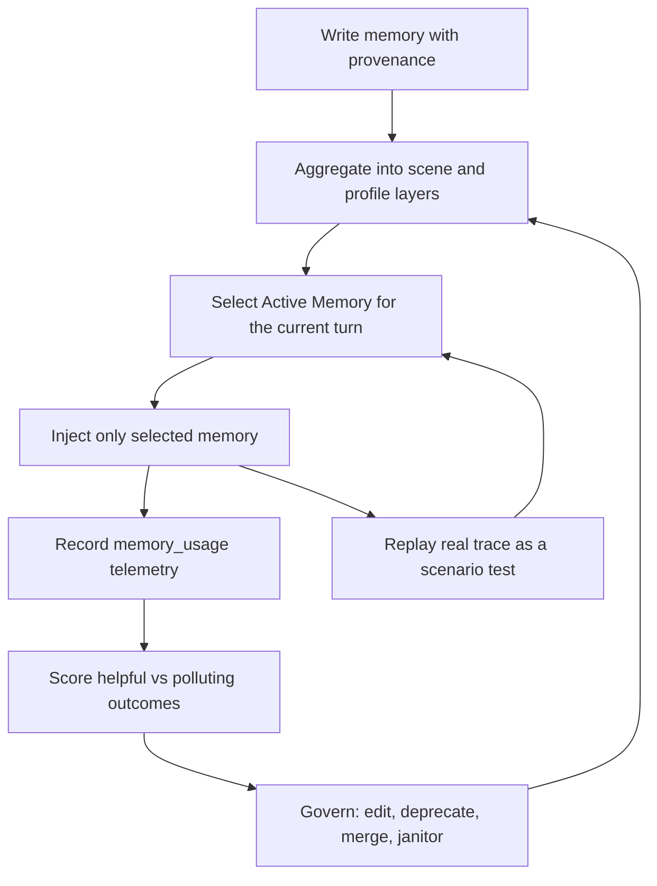

# The Hard Part of Agent Memory Is Forgetting

> Agent memory is not a storage problem. It is a control-system problem.

We learned this the annoying way.

A user asked for a PowerPoint. The agent had a long-term memory that the user liked dark, technical slide decks. That memory was real. It had been true in an earlier context. But the new task was a business sponsorship deck, where the right default was bright, clean, and commercially credible.

The agent did what many memory-enabled agents do: it remembered too eagerly.

Then a second failure appeared. In the same conversation, the user asked a follow-up question:

> So what file should be delivered in the end?

The sentence did not contain the word “PowerPoint.” A naive memory selector looking only at the current turn could lose the task context. Worse, because the trace contained shared test phrases, an unrelated preference such as “the user likes spicy food” could be ranked as a candidate. It sounds absurd until you inspect real traces. Weak lexical overlap, stale preferences, and missing conversation context are enough to make an agent remember the wrong thing.

That is the moment we stopped treating memory as “RAG over user facts.”

RAG asks: “What documents are relevant to this query?”

Agent memory has to ask harder questions:

- Should this memory influence the current decision?
- Is it a stable preference, a scene-specific rule, or a one-off fact?
- What happens if two memories conflict?
- How do we know whether this memory helped or polluted the answer?
- When a memory is proven harmful, how does it leave the system?

This article describes how we rebuilt AgentClaw’s memory layer into a controlled system: active recall, layered memory, governance, telemetry, scenario replay, and automatic cleanup.

The result is not “more memory.” The result is safer memory.

---

## The Failure Mode: Memory Turns Into Policy

Most agent teams start with a simple loop:

1. Extract facts and preferences from conversation.
2. Store them in a database.
3. Search the database before each response.
4. Inject the top results into the prompt.

This is enough for a demo. It is not enough for production.

The problem is that memory inside an agent prompt is not passive context. It becomes part of the policy the model follows. If the memory is stale, too broad, or in the wrong scene, the agent does not merely “retrieve a bad document.” It makes a bad decision.

Here are the failures we saw in real traces.

| Failure | What it looks like | Why normal retrieval fails |
|---|---|---|
| Stale preference | A previous dark-slide preference affects a business deck | The memory is true but not authoritative for this scene |
| Missing turn context | A follow-up question omits “PPTX,” so recall drifts | Current-turn search loses conversation continuity |
| Conflicting preferences | “Use dark style” and “use white-blue style” both enter the prompt | Search has no lifecycle model for superseded memory |
| Edited memory with stale embedding | Text says one thing, vector still represents old content | Update logic changes content but not retrieval semantics |
| Prompt-only fixes | A trace is fixed once, then fails with different wording | No scenario replay exists in the default test chain |

These are not model failures. They are system-design failures.

The core mistake is assuming that remembering is always good. In agent systems, remembering is only good when the remembered information is valid for the current decision.

---

## The Thesis: Memory Needs a Control Loop

We redesigned memory around one principle:

> A memory should not be allowed to influence an agent unless the system can explain why it was recalled, measure whether it helped, and remove it when it causes harm.

That gives us a control loop:



The key word is “loop.” A memory is not done when it is written. It has to survive recall, use, evaluation, and cleanup.

This design changed how we judged memory quality. We no longer ask only whether a memory can be found. We ask whether it should have been found, whether it helped, and whether the system can prevent a similar mistake from returning.

---

## Layer 1, 2, 3: Memory Needs Shape

Flat memory becomes noise. If every extracted fact competes equally for prompt space, the agent gets a pile of fragments instead of a decision aid.

We split long-term memory into three layers.

| Layer | Meaning | Example | Role |
|---|---|---|---|
| L1 | Atomic evidence | “The user said final PPTX delivery must include a `.pptx` file.” | Traceable source facts |
| L2 | Scene memory | “In PPTX delivery, preview first, then send the verified `.pptx`.” | Task-specific recall |
| L3 | Stable profile | “The user values direct answers and real validation.” | Cross-task preference |

L1 memories are not bad. They are the evidence. But the agent should not read every piece of evidence on every turn. It should usually consume L2 scene rules and L3 stable preferences, with links back to L1 sources.

A scene memory carries provenance:

```json
{
  "layer": "L2",
  "source": "scene_aggregate",
  "sceneName": "PPTX delivery",
  "sourceMemoryIds": ["m1", "m2", "m3"],
  "confidence": 0.95
}
```

This gives us two properties that flat memory does not:

- We can recall compact, high-level behavior without flooding the prompt.
- We can audit where the behavior came from.

For agent teams, this is the first important design move: do not treat every memory as the same kind of thing.

---

## Active Memory: Top-K Is Not Enough

The next problem is recall.

Classic retrieval says:

```text
query -> vector / BM25 search -> top-k -> prompt
```

For agent memory, top-k is too blunt. A memory can be textually related and still not be decision-relevant. So we added Active Memory selection before prompt injection.

The pipeline is:

1. Search broadly across candidate memories.
2. Rank deterministically by overlap, scene fit, layer, and task signals.
3. Build a small shortlist.
4. Ask a provider-backed selector to choose at most five directly useful memories.
5. If the selector fails, use a deterministic fallback, never full injection.

The last rule matters most.

When a selector returns empty output, times out, or hits a token limit, the safe behavior is not “inject everything.” The safe behavior is “inject only the best deterministic candidates.”

In pseudocode:

```ts
const ranked = rankActiveMemoryCandidates(query, candidates);

const fallback = ranked
  .filter((item) => item.score >= threshold)
  .slice(0, 5);

const selected = await selector.choose({
  request: query,
  candidates: ranked.slice(0, 8),
});

return selected.ok ? selected.memories : fallback;
```

This sounds obvious after the fact, but it is a common production trap. A failed selector is exactly when you should reduce risk. Falling back to full prompt injection increases risk at the worst moment.

---

## Conversation Continuity: The Current Turn Is Not the Task

The most important recall bug we fixed was not an embedding bug. It was a context bug.

Users write follow-ups:

```text
Turn 1: Help me make a PPTX.
Turn 2: So what should the final file be?
```

If Active Memory only sees turn 2, it may not know this is still a PPTX task. The memory query must include recent user turns, not just the current input.

The simplified shape is:

```ts
const memoryQuery = [
  ...recentUserTurns.slice(-2),
  currentUserInput,
].join("\n");
```

This one change made the system much closer to how real users speak. People do not restate the full task every turn. An agent memory system that ignores recent user messages will eventually recall the wrong memory for an underspecified follow-up.

In our scenario replay, this became a hard test:

- Seed a relevant PPTX delivery memory.
- Seed an irrelevant “likes spicy food” memory.
- Add a previous user turn about PPTX delivery.
- Ask a follow-up that omits “PPTX.”
- Assert that the PPTX memory is active and the food memory is not.

That test now runs in the default test chain.

---

## Governance: Memory Must Have an Exit

A memory system with only `add` and `search` is not a memory system. It is a landfill.

We added three governance primitives.

### Edit

Editing content must update the embedding. Otherwise the visible text and retrieval semantics diverge.

```ts
if (updates.content !== undefined && updates.embedding === undefined) {
  updates.embedding = await generateEmbedding(updates.content);
}
```

This is a subtle bug. The UI looks correct, but search still behaves as if the old memory exists.

### Deprecate

Bad memory should not always be physically deleted. Deletion erases evidence. We mark it instead:

```json
{
  "status": "deprecated",
  "deprecatedReason": "manual stale memory",
  "deprecatedAt": "2026-05-15T..."
}
```

Search and prompt formatting skip deprecated memories.

### Merge

Duplicate or fragmented memories should converge into a canonical target:

```json
{
  "status": "superseded",
  "supersededBy": "target-memory-id"
}
```

The target keeps `sourceMemoryIds` and evidence. The old memories remain auditable but stop influencing the agent.

This is not an admin-panel feature. It is part of the runtime safety model. If memory cannot be corrected, replaced, and retired, it will eventually poison the prompt.

---

## Telemetry: Measure Whether Memory Helped

Once a memory reaches the prompt, we record it.

The `memory_usage` event captures:

```text
memory_id
source
conversation_id
trace_id
agent_id
metadata
used_at
```

The important field is `metadata.outcome`.

```json
{ "outcome": "helpful" }
```

or:

```json
{ "outcome": "polluting" }
```

From this, we compute per-memory quality:

| Metric | Meaning |
|---|---|
| totalUses | How many times this memory entered context |
| activeMemoryUses | How often it was selected as Active Memory |
| helpfulUses | How often it was later marked useful |
| pollutingUses | How often it was marked harmful or misleading |
| effectivenessRate | helpfulUses / totalUses |
| pollutionRate | pollutingUses / totalUses |

This changes the operational posture. Memory quality is no longer a feeling. It becomes a measurable property.

---

## The Janitor: Forgetting With Evidence

The most important piece we added is automatic cleanup.

If a memory has enough usage history and is repeatedly marked polluting, the system deprecates it automatically.

The default rule is intentionally conservative:

| Condition | Default |
|---|---|
| Minimum uses | 2 |
| Pollution threshold | 0.5 |
| Pollution must beat helpfulness | yes |
| Already deprecated or superseded | skipped |

When triggered, the janitor writes evidence into metadata:

```json
{
  "status": "deprecated",
  "deprecatedReason": "memory_janitor:pollution",
  "janitor": {
    "reason": "pollution",
    "totalUses": 2,
    "helpfulUses": 0,
    "pollutingUses": 2,
    "pollutionRate": 1
  }
}
```

It is also wired into daily consolidation. The same job that decays importance, merges duplicates, and prunes stale entries now runs the janitor.

This is the difference between a memory database and a memory control system. The database stores. The control system removes influence when evidence says the memory is harmful.

The hard part of memory is not remembering. It is forgetting with evidence.

---

## Scenario Replay: Fix the Class, Not the Instance

The old way to fix an agent failure is to tweak the prompt and rerun the same input.

That is not enough.

Real agent failures often depend on:

- the original user wording,
- conversation history,
- what memory was already present,
- which tools were exposed,
- what side effects happened,
- and what the user ultimately saw.

So after a memory failure, we extract the trace into a scenario replay test. The test does not merely check a helper function. It recreates the shape of the real failure.

For the PPTX follow-up bug, the replay verifies:

| Assertion | Expected |
|---|---|
| Relevant PPTX memory selected | yes |
| Irrelevant food preference selected | no |
| Usage source | `active_memory` |
| Test runs by default | yes |

For governance, the replay verifies:

| Operation | Expected |
|---|---|
| Edit memory | content changes and embedding regenerates |
| Deprecate memory | search no longer returns it |
| Merge memories | canonical target visible, sources superseded |
| Janitor | polluting memory deprecated, helpful memory retained |

This matters more than the exact implementation. If a future refactor breaks the behavior, the test fails. We are no longer relying on a developer remembering the incident.

---

## What Changed in Practice

Here is the before and after.

| Situation | Before | After |
|---|---|---|
| Selector returns empty output | Risk of broad memory injection | Deterministic fallback to a small ranked set |
| User follow-up omits task keyword | Recall may drift | Recent user turns are part of the memory query |
| Old preference conflicts with new task | Both may enter prompt | Deprecated and superseded memory is skipped |
| Memory text is edited | Embedding may stay stale | Content update regenerates embedding |
| Bad memory repeatedly pollutes context | Human must notice and delete | Janitor deprecates it with evidence |
| A real trace fails | Prompt patched once | Scenario replay enters default tests |

We also ran production-like validation, not just unit tests:

| Validation | Result |
|---|---|
| Focused memory store tests | passed |
| Gateway route tests | passed |
| Core scenario replay | passed |
| Full `pnpm test` / typecheck / build | passed |
| Real HTTP janitor run | polluting memory deprecated |
| Real HTTP consolidate run | janitor triggered automatically |
| Isolated namespace replay | no test memory residue |

The point is not the exact numbers. The point is the validation shape: real entry, real side effect, real reread, clear pass/fail condition.

---

## Design Rules Other Teams Can Steal

If you are building memory for agents, here is the checklist I would start with.

### 1. Treat memory as policy, not context

Anything injected into the prompt can change behavior. Apply higher standards than you would for normal retrieval.

### 2. Separate evidence, scenes, and profile

Do not flatten everything into a single memory type. Atomic facts, scene rules, and stable user profile belong at different layers.

### 3. Never fall back to full injection

Selector failure should narrow the blast radius, not widen it.

### 4. Use recent conversation turns in recall

The current turn is not the full task. Follow-up questions require conversation continuity.

### 5. Give every memory an exit path

Support edit, deprecate, merge, and supersede. If memory cannot leave the decision path, it will become a liability.

### 6. Record memory usage

If you cannot answer “which memory influenced this response,” you cannot debug memory.

### 7. Track pollution, not just recall

A memory that is frequently recalled is not necessarily good. It may simply be frequently harmful.

### 8. Automate cleanup

Humans should not maintain memory quality by browsing lists. Humans should review exceptional cases; the system should handle obvious pollution.

### 9. Convert real incidents into replay tests

Do not test the prompt you wish users wrote. Test the wording they actually used.

### 10. Prefer boring mechanisms over clever prompts

Schema, metadata, lifecycle states, telemetry, and tests beat “please use memory carefully.”

---

## The Bar for Mature Agent Memory

A mature agent memory system should be able to answer these questions:

1. Why was this memory written?
2. Which original events support it?
3. Why was it selected for this turn?
4. Did it help or pollute the answer?
5. What happens if the user later corrects it?
6. Can it be merged into a better canonical memory?
7. Will it stop influencing the agent after being deprecated?
8. Is there a replay test for the incident that created the fix?
9. Does cleanup run automatically?
10. Does the system remain stable without a human tuning panel?

If the answer to any of these is “no,” the memory system is still a prototype.

---

## Closing

The easiest memory system to build is one that remembers everything.

The safest memory system is one that earns the right to remember.

That requires more than embeddings. It requires lifecycle, provenance, selective recall, telemetry, governance, automatic cleanup, and scenario replay.

The lesson we took from this work is simple:

> The hard part of agent memory is not remembering. It is forgetting with evidence.

When you design memory this way, the agent stops becoming a pile of accumulated preferences and starts becoming a system that improves without accumulating every mistake forever.
