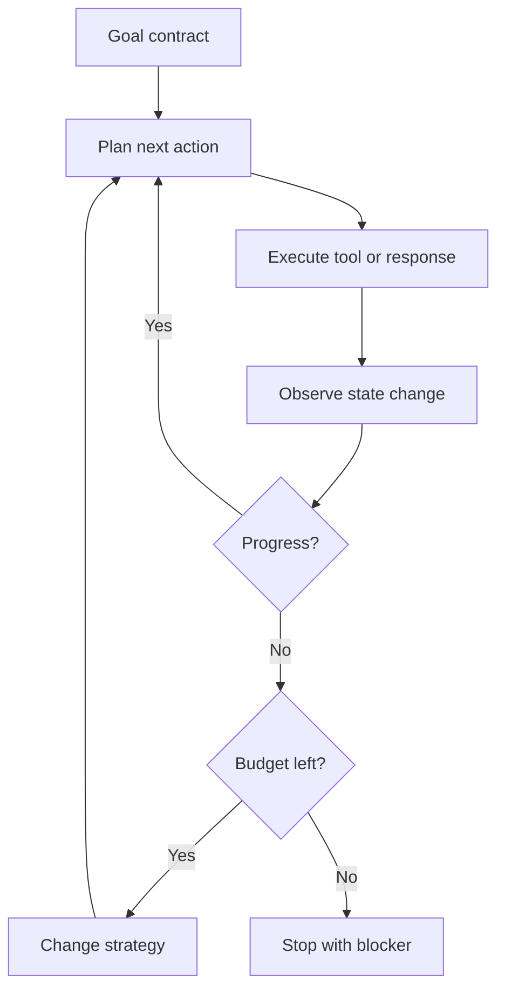

# 01. Agent Loops Need Brakes Before They Need Speed

> The first production problem in an agent loop is not making it act. It is making it stop for the right reason.

This curriculum starts where most agent demos stop: the loop. The earliest version feels magical. The model thinks, calls a tool, observes the result, and calls another tool. Add a browser, a shell, and file access, and it begins to look like work.

Then it runs the same failed command again. Then it searches a path it already proved does not exist. Then it asks a subtask to verify a fact the parent already knows. The loop is alive, but it is not governed.

The thesis of this lesson is the foundation for the rest of the series:

> Autonomy is useful only when the system has independent stopping conditions.

---

## The Failure Mode: Progress Theater

An unconstrained agent can create a convincing transcript while making no real progress. Every step has a plausible local explanation. The total trace is waste.

| Symptom | What the trace shows | Missing brake |
|---|---|---|
| Repeated tool call | Same command or search with tiny wording changes | Duplicate-action detection |
| Endless repair | The agent keeps fixing the fix | Failure budget per objective |
| Goal drift | It optimizes a subtask and forgets the deliverable | Persistent task contract |
| Silent stall | Long reasoning, no state change | Progress checkpoint |
| User fatigue | It asks broad questions instead of reporting a blocker | Escalation rule |

A loop is not safe because it has a `maxIterations` number. That only limits damage after the system has already lost control. A safer loop knows why another iteration is justified.

In production terms, this is the first curriculum gate: every agent action must be tied to an observable state change, a remaining budget, or an explicit blocker.

---

## The Control Loop

The important part is the `Observe state change` box. The loop must compare the world before and after an action. Did a file appear? Did a test failure change? Did the page navigate? Did a memory write happen? Did the user-visible artifact move closer to the contract?

Without state comparison, the loop can only trust the model's story about progress.

---

## Brakes That Actually Work

| Brake | What it prevents | Implementation shape |
|---|---|---|
| Iteration budget | Infinite loops | Hard upper bound per task |
| Duplicate detector | Repeating the same failed action | Normalize command/tool signature and result |
| Failure counter | Endless retries | Count failures by objective, not only by tool |
| Deliverable contract | Goal drift | Carry requested artifact/type/state through the loop |
| Escalation rule | Fake confidence | Stop and report blocker when evidence is exhausted |

The combination matters. A max-iteration limit catches runaway behavior late. Duplicate detection catches it early. A deliverable contract keeps the loop pointed at the user's result. Escalation prevents the agent from inventing certainty after the evidence runs out.

---

## Acceptance Tests

A loop change is not verified because the model sounds better. It is verified when old bad traces terminate correctly.

| Scenario | Expected behavior |
|---|---|
| Missing file | Search enough places, then stop with a clear absence report |
| Repeated failing command | Do not run the same command again without a changed condition |
| Tool outage | Retry according to policy, then surface the blocker |
| Long artifact task | Keep the final artifact type through substeps |
| User correction | Change strategy immediately instead of finishing the old plan |

These are not unit tests for a helper function. They are trace-level tests for the control loop. A curriculum implementation should keep a small corpus of bad traces and require each one to stop for the right reason.

---

## Boundary

Some tasks require persistence. Debugging a flaky integration may need several failed attempts. The brake should not punish useful exploration. The difference is whether each attempt changes a meaningful variable: input, environment, hypothesis, or tool path.

If nothing changes, another iteration is not persistence. It is noise.

## Principle

Build the brakes before you celebrate autonomy. A loop that cannot justify its next turn is already too free.
