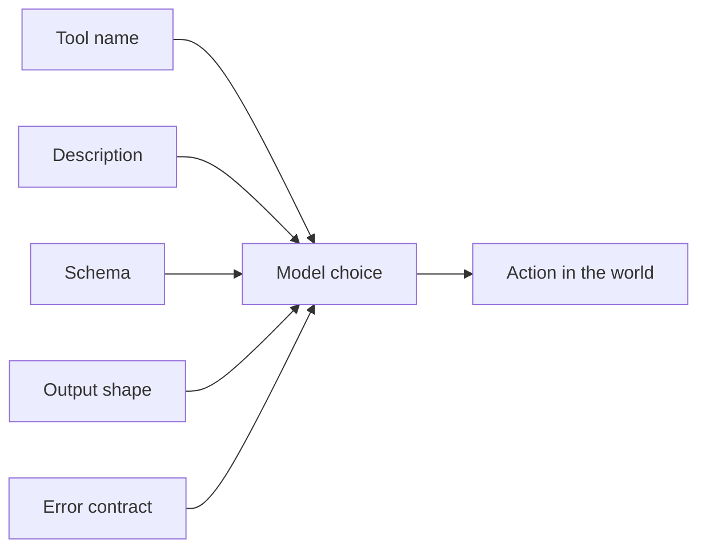

# Tool Systems Fail at the Interface, Not the Function Body

> Most tool bugs are not inside the tool. They are in the contract the model believes the tool has.

A shell command can be correct. A browser click can work. A file reader can return exactly what it found. The agent can still choose the wrong tool, pass the wrong argument, or treat a preview as the final artifact.

That is why tool design is not API design with natural-language labels. It is model-facing interface design.

> A tool is safe only when its name, schema, description, output, and failure mode all teach the model the same contract.

---

## The Failure Mode: Correct Function, Wrong Mental Model

| Interface flaw | Model behavior | Production result |
|---|---|---|
| Vague description | Chooses a broad tool for a narrow task | Slow traces and irrelevant output |
| Loose schema | Sends partial or ambiguous arguments | Repair loops |
| No output class | Treats preview, source, and final artifact the same | Wrong delivery |
| Soft error | Reads failure as information, not instruction | Repeats the bad action |
| Too many similar tools | Tool selection becomes guesswork | Unstable behavior across models |

The model does not read your code. It reads the tool surface you expose. If that surface is ambiguous, the implementation can be perfect and the agent will still fail.

---

## The Contract Surface

The name should encode the action. The description should say when to use it and when not to use it. The schema should force required distinctions. The output should mark whether the result is final, preview, intermediate, or diagnostic. Errors should tell the agent the next legal move.

A tool that returns "failed" has given the agent a dead end. A tool that returns "this path is outside the workspace; choose a path under X" has given the agent a constraint.

---

## Design Tests

| Question | Good answer |
|---|---|
| Can two tools be confused? | Merge them or sharpen the descriptions |
| Can arguments be invalid but plausible? | Move ambiguity into schema enums or validators |
| Can output be mistaken for a final result? | Add artifact class and required delivery checks |
| Can the model recover from failure? | Error response names the next valid action |
| Can a dangerous tool be selected casually? | Require explicit permission or route through a safer wrapper |

These tests are cheap and catch more agent bugs than another paragraph of prompt advice.

---

## Trade-Offs

A smaller tool surface is easier for the model to use, but can force too much behavior into one overloaded tool. A larger surface is expressive, but increases selection errors. The practical boundary is not tool count; it is semantic distance. Ten tools with distinct verbs are easier than four tools with overlapping responsibilities.

The same applies to schemas. Rich schemas are good when they encode real decisions. They are bad when they reproduce implementation details the model should not care about.

---

## Principle

Tool design is the art of making the correct action obvious and the dangerous action structurally difficult.
