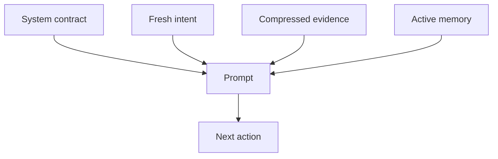

# 03. Context Is a Budget, Not a Bucket

> The context window is not where an agent stores everything it knows. It is where the next decision gets biased.

Once the loop and tools are governed, the curriculum turns to influence. A 128K window can make teams careless. It feels large enough to keep the conversation, tool logs, stack traces, screenshots, memory snippets, and repeated instructions. But every retained token competes for attention.

The bug appears when the model follows an old observation over a new correction. The context is full, but the decision is under-informed.

> Good context management is influence management.

---

## The Failure Mode: Old Text Keeps Voting

| Old context | Bad influence |
|---|---|
| Failed path | The agent searches it again |
| Old style preference | The agent applies it to a new scene |
| Long tool output | The model attends to machine text more than the user |
| Summary without handles | The agent remembers "there was an error" but not which one |
| Rebuilt static prompt | Cache misses and subtle instruction drift |

The model cannot know which text is stale unless the system marks it, removes it, or demotes it.

The practical lesson is that context is not a transcript. It is an operating surface for the next action.

---

## The Layered Prompt

The system contract should be stable. Fresh intent should be protected. Evidence should be summarized with handles. Memory should be selected, not dumped. This layered shape prevents old context from arriving with the same authority as the latest instruction.

---

## Acceptance Criteria

| Scenario | Passing behavior |
|---|---|
| Follow-up question omits noun | Agent preserves the original task type from recent context |
| User changes requirement | New turn overrides old summary |
| Huge command output | Prompt contains excerpt and pointer, not full dump |
| Long-running task | Open decisions and blockers remain explicit |
| Compression active | File paths, commands, IDs, and deliverable requirements survive |

A production exercise should replay the same task with full history, compressed history, and a user correction. The correct implementation protects the latest user intent in all three cases.

---

## Boundary

Do not compress away uncertainty. A summary that removes the exact error message may save tokens and destroy debuggability. Compress prose first; preserve handles, evidence, and current user intent.

## Principle

Context is expensive because it changes behavior. Spend it only on text that deserves a vote in the next decision.
