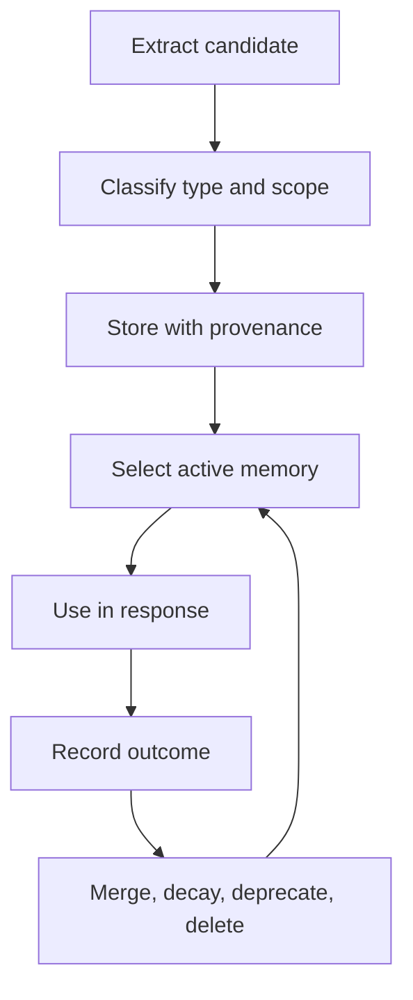

# 04. Memory Must Be Governed Before It Is Trusted

> Agent memory is dangerous because it looks like context while behaving like policy.

The fourth curriculum layer separates memory from ordinary context. A user once liked dark technical decks. Later they needed a clean commercial presentation. The stored preference was true, but applying it blindly was wrong.

That is the memory problem in one sentence: facts can be accurate and still harmful.

> The question is not whether the agent can remember. The question is whether the memory is allowed to influence this decision.

---

## The Failure Mode: Accurate but Invalid

| Memory type | Risk |
|---|---|
| Stable identity | Low risk, long lifetime |
| Preference | Medium risk, scene-dependent |
| Project fact | Medium risk, must track source and date |
| Temporary instruction | High risk, should expire quickly |
| Extracted inference | Highest risk, needs confidence and review |

A flat memory table cannot express those differences. Retrieval alone cannot decide authority.

The production question is not "did retrieval find something relevant?" It is "is this recalled fact allowed to affect this task?"

---

## Governance Loop

Memory needs lifecycle. A preference can be scoped to presentation design. A project fact can expire when a repo changes. A harmful memory can be deprecated. A duplicate can be merged. A memory with stale embedding must be re-indexed when edited.

---

## Acceptance Criteria

| Scenario | Passing behavior |
|---|---|
| Conflicting preferences | Current explicit instruction wins |
| Follow-up turn | Relevant scene memory can still be recalled |
| Stale style memory | Not applied outside its scene |
| Memory edit | Retrieval semantics update with the text |
| Bad memory | Telemetry can identify and remove it |

The curriculum test is conflict. Store a true but scene-bound preference, then give a fresh instruction that conflicts with it. A governed memory system must let the current instruction win and record why the memory was demoted.

---

## Boundary

Do not make memory too clever too early. A small governed memory layer beats a large magical one. Start with provenance, scope, recency, and explicit conflict rules before adding embedding sophistication.

## Principle

A memory should earn influence every time it is recalled.
