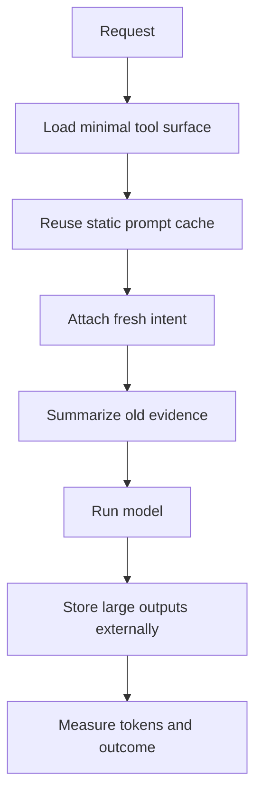

# The Token Economy Is a Systems Problem

> Token waste is usually not one expensive model call. It is repeated context, hidden background work, and tool output that should never have entered the prompt.

Teams often optimize the visible part of agent cost: choose a cheaper model, shorten the answer, reduce temperature. Those help, but they miss the larger system effect.

An agent pays for the same facts repeatedly: tool schemas, system rules, conversation history, memory snippets, logs, summaries, retries, and background extraction.

> Token cost is an architecture bill.

---

## The Failure Mode: Invisible Multipliers

| Multiplier | Why it grows |
|---|---|
| Static prompt | Rebuilt every turn instead of cached |
| Tool catalog | Too many tools loaded unconditionally |
| Raw output | Large command/browser results copied into context |
| Retry loops | Same failure context resent repeatedly |
| Background tasks | Memory, titles, summaries, and routing call models too |
| Multi-channel wrappers | Platform metadata duplicated into every turn |

The largest savings usually come from removing repeated input, not shaving a few words from output.

---

## Cost Control Architecture

A good token system tracks both cost and correctness. If token usage falls while task completion falls too, the system has optimized the wrong variable.

---

## Practical Controls

| Control | Effect |
|---|---|
| Static prompt freezing | Better cache behavior and less instruction drift |
| Conditional tool loading | Smaller prompts and fewer wrong tool choices |
| Output previews | Prevents raw logs from dominating the context |
| Deterministic truncation | Keeps the agent alive under pressure |
| Scenario replay | Catches optimizations that break behavior |

---

## Boundary

Do not underfeed the model. A cheap wrong answer is still expensive because it creates user correction, retries, and trust loss. Preserve the handles needed for action: filenames, commands, IDs, error signatures, and deliverable contracts.

## Principle

Reduce tokens by removing repeated influence, not by hiding the facts the agent needs to finish.
