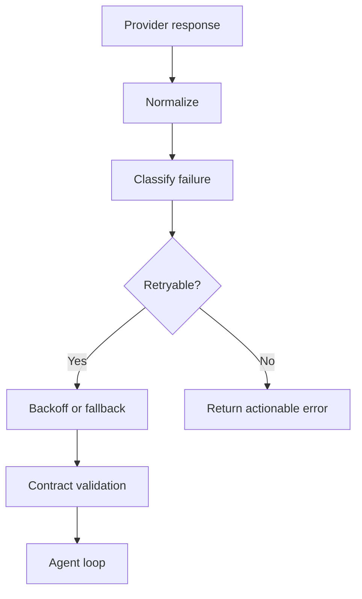

# Every LLM Call Is a Failure Boundary

> Treat every model call as an unreliable network boundary, even when the provider returns 200 OK.

An agent can fail before the first token, after the first token, inside a JSON field, inside a provider-specific compatibility rule, or after a response that sounds valid but cannot be parsed by the next step.

The model is not a local function. It is a remote dependency with probabilistic output and provider-specific behavior.

> Production agents need model adapters, error taxonomies, and recovery rules, not just retries.

---

## The Failure Mode: Success-Shaped Failure

| Failure | Why naive code misses it |
|---|---|
| 200 OK with error body | HTTP layer says success |
| Streaming failure mid-response | Fallback cannot safely switch after partial output |
| Provider rejects reasoning fields | OpenAI-compatible does not mean behavior-compatible |
| Malformed JSON | Text generation succeeded, contract failed |
| Repeated content | Model is alive but stuck |
| Context too large | Retry without compression repeats the failure |

A retry loop without classification is just a faster way to waste tokens.

---

## Adapter Design

The adapter owns provider weirdness. The agent loop should receive normalized success or a classified error. It should not know that one model family rejects a field another accepts.

---

## Recovery Rules

| Class | Response |
|---|---|
| Authentication/config | Stop and report configuration blocker |
| Rate limit | Backoff or switch provider if policy allows |
| Context limit | Compress or reduce tool surface before retry |
| Invalid contract | Ask model to repair only the invalid structure |
| Provider incompatibility | Strip or map unsupported fields in adapter |
| Mid-stream failure | Surface partial-state limitation; do not pretend seamless fallback |

---

## Boundary

Fallback is not always safe. If the first model has already streamed user-visible text or executed a tool based on partial reasoning, switching models can create incoherent state. Recovery policy must know whether side effects have already happened.

## Principle

The agent should not improvise around provider errors. The adapter should classify them, and the loop should follow policy.
