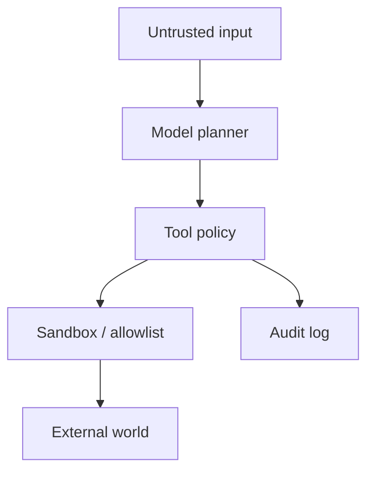

# Agent Security Starts With Tool Authority

> The dangerous question is not what the model knows. It is what the model is allowed to do after reading hostile text.

An agent with shell, browser, file, memory, and network tools is not a chatbot. It is an execution surface. Prompt injection matters because untrusted text can become instructions for tools with real authority.

> Agent security is permission design around a suggestible planner.

---

## The Failure Mode: Untrusted Text Becomes Action

| Threat | Example |
|---|---|
| Prompt injection | Webpage tells the agent to ignore prior rules |
| Path traversal | User asks to read outside the workspace |
| Secret exfiltration | Tool output or memory leaks tokens |
| SSRF | Browser/fetch reaches internal metadata endpoints |
| Shell injection | Natural language becomes dangerous command text |
| Memory poisoning | Malicious instruction is stored as future preference |

Traditional web security still applies, but the model adds a new bridge between text and action.

---

## Authority Layers

The model can propose. Policy decides. The sandbox limits damage. The audit log makes behavior reviewable.

---

## Controls That Matter

| Control | Purpose |
|---|---|
| Workspace boundary | Prevent arbitrary file reads/writes |
| Secret denylist | Block obvious credential material |
| SSRF guard | Stop private network and metadata access |
| Shell constraints | Reduce command injection and destructive operations |
| Memory write scan | Prevent hostile text from becoming future policy |
| Tool permission tiers | Keep high-authority tools out of low-trust contexts |

---

## Boundary

No prompt can secure a high-authority tool. Prompts are useful for explaining policy to the model, but enforcement must live in code, sandboxing, schemas, allowlists, and reviewable logs.

## Principle

Assume hostile text will reach the model. Design the system so hostile text still cannot acquire authority.
