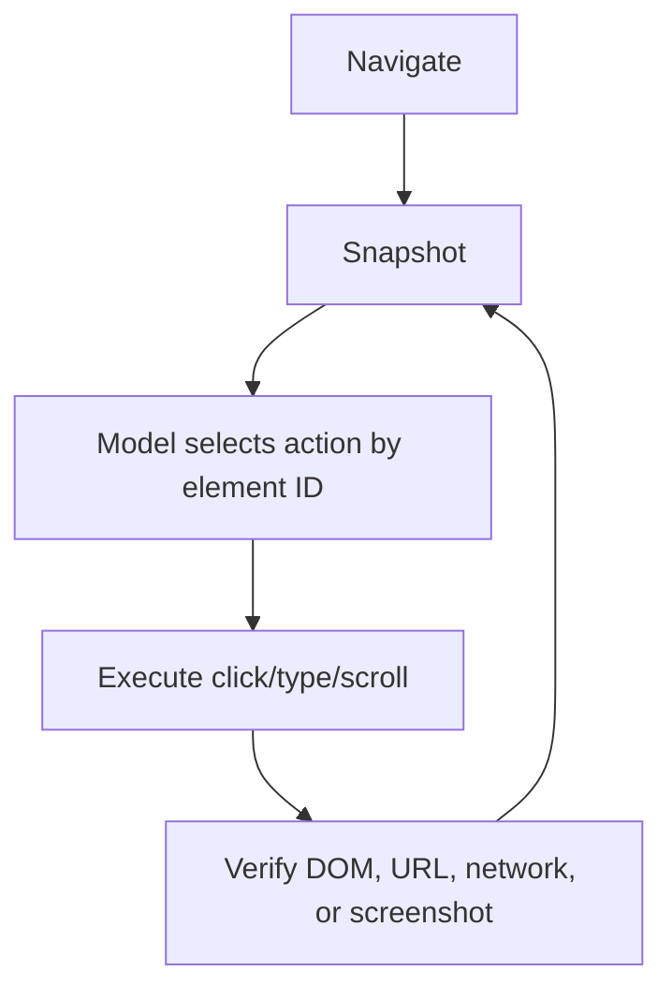

# 08. Browser Agents Need Perception, Not HTML Dumps

> A browser agent does not need the whole page. It needs the actionable structure of the page.

Browser automation is the curriculum's first full-system exercise: tool design, context control, verification, and security all meet on a live page. The naive browser tool sends raw HTML or screenshots to the model. Both fail differently. HTML is complete but enormous. Screenshots are intuitive but expensive and hard to act on precisely.

A production browser agent needs a perception layer.

> The right browser representation is the smallest structure that preserves what can be read, clicked, typed, and verified.

---

## The Failure Mode: Seeing Too Much or Too Little

| Representation | Strength | Failure |
|---|---|---|
| Raw HTML | Complete source | Token-heavy and full of irrelevant nodes |
| Screenshot | Human-like view | Poor action handles, expensive visual reasoning |
| DOM text | Cheap | Loses interactive structure |
| Accessibility snapshot | Action-oriented | Needs stable element IDs and refresh discipline |

The accessibility snapshot is usually the best default because it already represents what a user can perceive and operate.

The production lesson is to separate perception from execution. The model should reason over a compact page representation and act through stable handles.

---

## Browser Perception Loop

Element IDs matter. The model should not click by vague coordinate unless visual interaction is truly required. It should refer to stable handles like `e12` with labels, roles, and visible text.

---

## Verification

| Task | Verification |
|---|---|
| Navigation | URL and page title changed as expected |
| Form fill | Input value exists in DOM |
| Button click | Resulting element, toast, or network response appears |
| Download | File exists and type matches request |
| Responsive layout | Screenshot or DOM check across viewport sizes |

The curriculum exercise is to make the agent prove every browser action with a page-state check. A click without verification is only an input event, not task progress.

A browser action is not complete because Playwright clicked something. It is complete when the page state proves the click mattered.

---

## Boundary

Screenshots still matter for visual QA, canvas, charts, maps, and layout problems. The mistake is using screenshots as the default representation for every web task.

## Principle

Browser automation becomes reliable when the agent acts on structure and verifies state, not when it stares at pixels and guesses.
