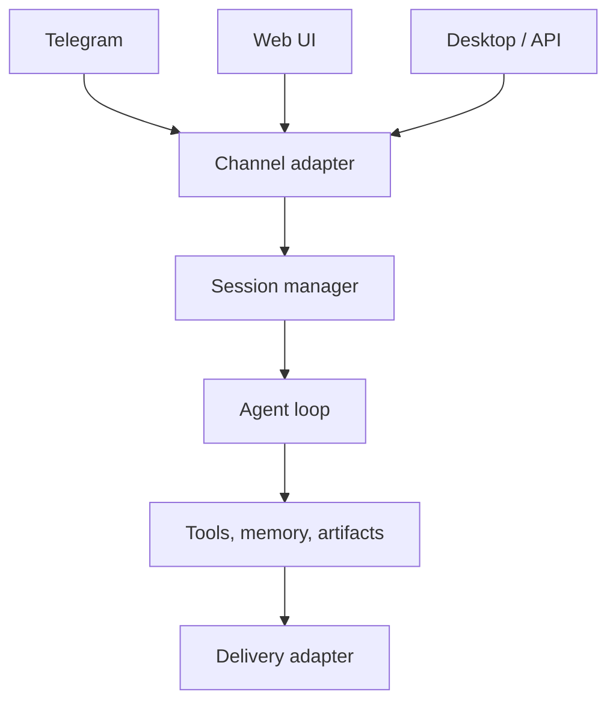

# Multi-Channel Agents Need One Brain and Many Adapters

> A Telegram agent, web agent, Slack agent, and desktop agent should not become four personalities with four memories.

The first version of a multi-channel system often copies message handling for each platform. It works until behavior drifts: one channel has timeouts, another has streaming, another splits long messages, another forgets memory, another cannot deliver files.

> Multi-channel architecture should centralize cognition and decentralize transport.

---

## The Failure Mode: Platform Forking

| Fork | Result |
|---|---|
| Separate session logic | Conversation continuity differs by channel |
| Separate memory path | User identity fragments |
| Separate file delivery | Same task succeeds on web and fails on chat |
| Separate timeout rules | Long tasks behave unpredictably |
| Separate formatting | Model learns channel quirks instead of task logic |

The channel should adapt messages. It should not own the agent brain.

---

## Shared Core, Thin Adapters

Adapters translate platform events into a shared internal message. The core owns planning, memory, tools, artifact contracts, and lifecycle. Delivery adapters translate the final result back into platform-specific constraints.

---

## Channel Contracts

| Concern | Shared core | Adapter responsibility |
|---|---|---|
| Identity | Stable user/session mapping | Platform user IDs |
| Message shape | Normalized text/files/events | Platform payload parsing |
| Timeouts | Task lifecycle policy | Typing indicators or keepalive |
| Artifacts | Final deliverable contract | Upload/link mechanism |
| Formatting | Semantic response blocks | Markdown/platform escaping |

---

## Boundary

Some platform behavior must stay platform-specific. Telegram file limits, browser previews, Slack threading, or desktop notifications should not pollute the core loop. The boundary is whether a rule changes the task semantics or only its transport.

## Principle

One agent brain, many transport adapters. Anything else becomes several products pretending to be one.
