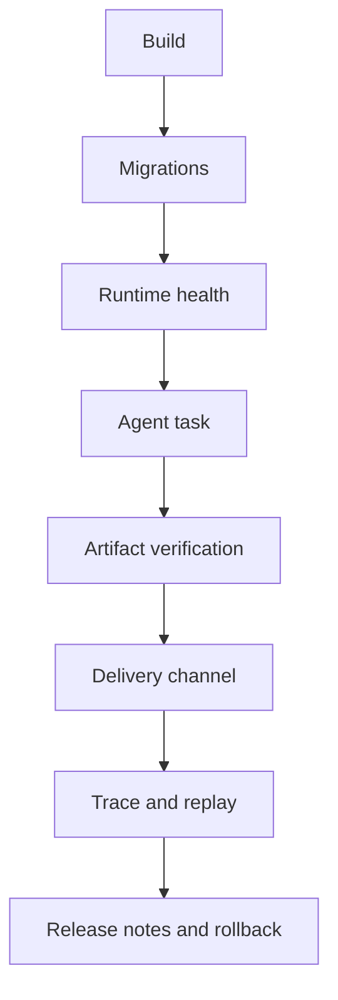

# Production Readiness Means the User Can Finish the Job

> A trace that ends is not the same as a task that is done.

The hardest production bugs in agent systems often happen after the impressive part. The model planned correctly. Tools ran. Logs looked green. Then the user could not open the file, the channel dropped the response, the server restarted mid-task, or the artifact path was local to the worker.

> Production readiness is the set of boring systems that preserve user-visible outcomes after the model has finished reasoning.

---

## The Failure Mode: Demo Success, Product Failure

| Demo success | Production failure |
|---|---|
| Local file exists | User cannot access it from chat or browser |
| Script runs once | Dependency missing on a fresh worker |
| Agent responds | Long channel message is truncated |
| Memory works locally | Migration missing in deployed DB |
| Browser task passes | Headless server lacks required runtime |
| Tests pass | Real trace with old state still fails |

Production is not one more environment. It is the place where all hidden assumptions are audited by users.

---

## Readiness Stack

Each layer answers a different question. Can the code run? Can the data evolve? Are dependencies alive? Did the task finish? Can the user access the output? Can we debug and replay the result? Can we explain what changed?

---

## Acceptance Criteria

| Area | Check |
|---|---|
| Build | Production bundle and docs build without local-only assumptions |
| Runtime | Health check verifies tools, storage, and configured providers |
| Data | Migrations are idempotent and backed up |
| Artifacts | Final deliverables are type-checked and reachable |
| Traces | User-visible failures become replay scenarios |
| Release | Changelog and commits explain one coherent change |

---

## Boundary

Not every prototype needs the full stack. But once a real user depends on the agent, production readiness is no longer optional polish. It is part of the feature.

## Principle

The agent is not done when it has an answer. It is done when the user can complete the job with the result.
