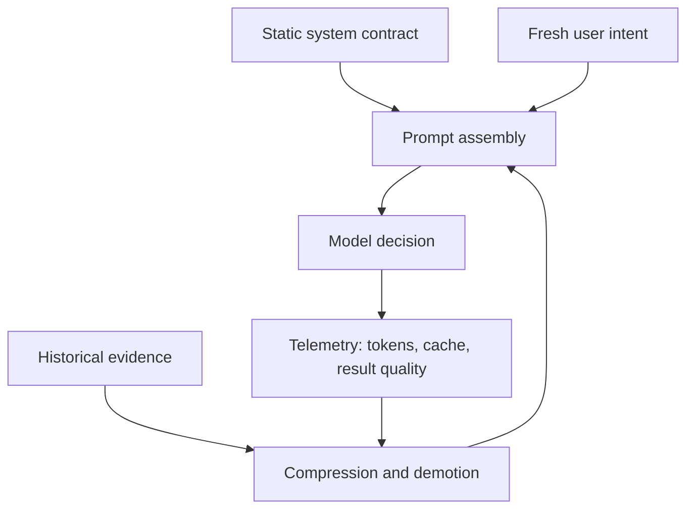

# Context Compression Is a Reliability Mechanism

> Context compression is not about making prompts smaller. It is about preventing old observations from becoming new instructions.

The first obvious symptom was cost. An agent burned roughly 170K tokens while trying to find a file that was not there. It read directories, repeated tool output, summarized the same failed search, and kept carrying old observations forward as if they were still useful.

The worse symptom was quieter. After enough tool output accumulated, the model began optimizing for the history instead of the task. It treated stale paths as leads. It gave equal weight to a current user correction and a ten-turn-old observation. It became slower, more expensive, and less accurate at the same time.

That is the failure most teams miss. A full context window is not only a billing problem. It is a decision-quality problem.

AgentClaw's context system was rebuilt around one thesis:

> The context window is a control surface. Every token that enters it should have a reason to still influence the next decision.

This article describes the mechanism we use: immutable system context, protected recent intent, structured summaries, tool-output demotion, compression waterfalls, and regression tests that check behavior rather than token counts alone.

---

## The Failure Mode: The Prompt Becomes a Junk Drawer

Long context windows make the early version of an agent feel safe. You can keep more turns, more tool results, more screenshots, more stack traces, and more explanation. The system seems more informed.

Then the junk drawer starts making decisions.

| Failure | What it looks like | Why it matters |
|---|---|---|
| Stale observation | A deleted path keeps appearing in later reasoning | The model keeps paying attention to a fact that is no longer actionable |
| Tool-output gravity | A huge command result dominates the prompt | The newest user intent competes with old machine text |
| Summary drift | A compressed history loses the exact user correction | The next turn follows the summary, not the user |
| Cache busting | Static instructions are rebuilt every turn | Identical work becomes expensive and slower |
| Compression panic | Everything is summarized only after the window is nearly full | The system loses structure exactly when precision is needed most |

The core mistake is treating context as storage. Storage can keep everything. Context cannot. Context is the material the model uses to choose the next action.

---

## The Mechanism: Protect Fresh Intent, Demote Old Evidence

A useful context manager has to separate three kinds of text.

The first layer is the static contract: system instructions, tool schemas, safety boundaries, and project rules. These should not be regenerated casually. If the system prompt is rebuilt with noisy differences every turn, prompt caching loses value and the model sees a slightly different operating environment.

The second layer is the fresh tail: the latest user request, the immediate correction, and the last few actions required to preserve continuity. This layer is protected. It is the part most likely to contain the real task.

The third layer is historical evidence: previous tool results, old reasoning, failed paths, summaries, and completed substeps. This layer is aggressively demoted. It can remain available, but it should not arrive with the same authority as a current instruction.

That separation gives the agent a stable order of influence:

1. Rules and tool contracts define what is allowed.
2. Fresh user intent defines what should happen now.
3. Historical evidence helps only when it still explains the current situation.

---

## The Waterfall: Compress Before the Emergency

A single compression strategy is too fragile. We use a waterfall because different pressure levels need different behavior.

| Pressure | Strategy | What must survive |
|---|---|---|
| Normal | Structured summary of completed work | Current goal, open decisions, files touched, unresolved blockers |
| High | Aggressive tool-output pruning | Errors, paths, IDs, commands, and final artifact requirements |
| Critical | Deterministic truncation of old low-value text | The protected recent tail and system contract |

The important detail is not the exact threshold. The important detail is that compression is not a last-second rescue. If the first time the system thinks about context is when the prompt is already too large, it will cut blindly.

Good compression is boring because it happens continuously. Tool results that are too large are written to disk or artifact storage. The model sees a preview and a pointer, not the entire payload. Repeated observations are collapsed into one fact. Failed attempts are summarized as negative evidence: "searched X and did not find Y," not repeated as raw transcripts.

---

## Evidence: Measure Decisions, Not Only Tokens

Token charts are useful, but they can lie. A system can reduce token usage by deleting information the model needed. That is not optimization; it is amputation.

The acceptance tests have to ask behavioral questions:

| Check | Passing behavior |
|---|---|
| Missing file search | The agent stops after enough negative evidence and reports the absence clearly |
| User correction | A recent correction beats older summarized assumptions |
| Large output | Raw output is stored externally and the prompt receives only actionable excerpts |
| Follow-up turn | The agent preserves the original deliverable type even when the user omits the noun |
| Cache stability | Static instructions remain stable across turns unless the tool surface changes |

This is why trace replay matters. The real bug is rarely "prompt has too many tokens" in isolation. The bug is "because the prompt carried the wrong history, the agent made the wrong next move."

---

## Boundaries and Trade-Offs

Compression can make an agent worse when it hides uncertainty. A summary that says "the build failed" is much less useful than "the build failed because `pnpm test` could not resolve module X after commit Y." The system must preserve handles: filenames, commands, error signatures, trace IDs, artifact paths, and user-facing requirements.

There is also a latency trade-off. LLM-based summarization can itself cost tokens and time. That is why the fallback layer is deterministic. When pressure is high, a simple rule that preserves the fresh tail is often safer than a clever summary that arrives late or rewrites facts.

The practical rule is simple: compress prose, preserve handles.

---

## Design Rules

- Treat context as influence, not storage.
- Preserve the newest user intent even when everything else is compressed.
- Convert old tool output into evidence summaries with pointers to full artifacts.
- Store large outputs outside the model context by default.
- Make compression observable: token counts, cache hits, cut reasons, and outcome quality.
- Test compression with real traces where stale context previously changed behavior.

The best context manager is not the one that fits the most text. It is the one that keeps the right text powerful and makes the rest harmless.
