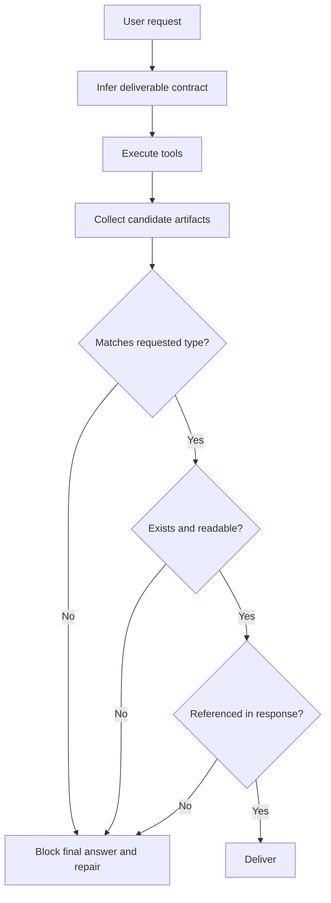

# The Last Mile Is Where Agent Work Disappears

> Tool success is not delivery. A task is done only when the user can use the requested result.

The trace looked successful until the last screen. The agent planned a presentation, generated slides, rendered a preview, and produced a file link. The intermediate steps were convincing. The user had asked for a PowerPoint.

The final artifact was a PDF.

This is one of the most common production-agent failures because every layer can honestly report success. The script ran. The renderer produced something. The assistant responded. The trace closed. But the user did not get the thing they asked for.

For teams building agents that create files, code, reports, media, or deployed surfaces, this is the point where "task completed" has to become an enforceable delivery state.

The thesis is simple:

> Agent systems need delivery gates because models optimize for plausible completion, while users need usable completion.

---

## The Failure Mode: Preview Becomes Product

File tasks are especially dangerous because agents often create several artifacts on the way to the requested one: source code, logs, screenshots, thumbnails, PDFs, images, and final files. Without a hard delivery contract, the most visible artifact can accidentally become the final answer.

| User asked for | Agent may create | Common wrong delivery |
|---|---|---|
| `.pptx` deck | Python script, PNG preview, PDF export, PPTX | PDF or preview image |
| `.docx` report | Markdown draft, HTML preview, PDF render, DOCX | Markdown or PDF |
| Spreadsheet | CSV, JSON, chart image, XLSX | CSV without formulas or workbook formatting |
| Video | frames, audio, subtitles, MP4 | still frame or script |
| Website | source files, build output, local URL | unbuilt source path |

The final answer must not guess which artifact matters. The runtime has to know.

---

## The Delivery Contract

A delivery gate is a small contract that runs after tool work and before the final response.

The contract should include type, path, accessibility, and user-visible reference. In an AgentClaw PPTX trace, that meant the `.pptx` had to exist, open or pass a structural check, and be the file linked or attached in the final response. A PDF preview could be helpful, but it could not satisfy the contract because the user asked for editable slides.

---

## Why Prompting Is Not Enough

You can tell the agent, "Always deliver the requested file type." That helps until the next long trace, subagent, retry, or tool detour changes the local objective. The model may focus on "show the user something" instead of "deliver the exact artifact."

The delivery gate should be deterministic. It should not rely on the model to remember the file type at the end of a 20-step task.

| Soft instruction | Hard gate |
|---|---|
| "Please provide the PPTX" | Final response is blocked unless a `.pptx` artifact exists |
| "Don't send PDF unless requested" | PDF candidates are marked preview-only for PPTX tasks |
| "Make sure the file is available" | Path is checked after generation and before response |
| "Use the right tool" | Tool output is classified into source, preview, and deliverable |

A prompt can state intent. A gate enforces state.

---

## Evidence: Test the Artifact, Not the Story

The acceptance test for delivery should avoid model prose. It should inspect the artifact pipeline.

| Check | Passing condition |
|---|---|
| Type | Final deliverable extension and MIME match the user request |
| Existence | The path exists in the expected workspace or artifact store |
| Integrity | The file can be opened or parsed by a format-aware check |
| Response | The final message references the deliverable, not only a preview |
| Regression | Real traces where the wrong type was delivered now fail before response |

This is how a one-off embarrassing trace becomes a permanent runtime rule.

---

## Boundaries and Trade-Offs

Some tasks legitimately benefit from alternate outputs. A slide deck may include a PDF preview. A spreadsheet may include a chart image. A webpage may include a screenshot. The delivery system should support those as companion artifacts, not as replacements.

There are also ambiguous requests. "Send me the deck" usually means editable slides if the surrounding context is PPTX generation. "Give me a copy" may need inference. When inference is uncertain, the system can ask a short clarification before expensive work. After work begins, it should carry the inferred contract through the whole trace.

The trade-off is small friction for much higher trust. Users forgive a clarification. They do not forgive a confident wrong file.

---

## Design Rules

- Convert every file-generation request into an explicit deliverable contract.
- Classify artifacts as source, intermediate, preview, or final deliverable.
- Block final responses that do not satisfy the contract.
- Verify final artifacts with format-aware checks when available.
- Replay real wrong-delivery traces until the gate catches them.

Agents do not earn trust by producing many artifacts. They earn trust by handing over the right one.
