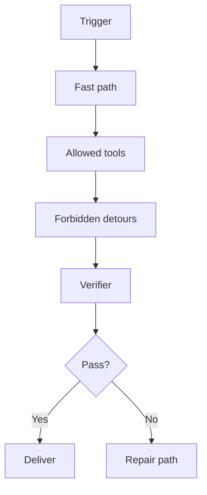

# Skills Are Runtime Contracts, Not Prompt Snippets

> A skill is valuable when it removes unsafe freedom from the agent. If it only adds advice, it is documentation with better branding.

The slow part of one PowerPoint workflow was not slide generation. It was the agent repeatedly checking whether `python-pptx` existed, sometimes trying to install it, and sometimes routing through unnecessary subtasks before writing the actual generation script.

Each step looked reasonable in isolation. Check the dependency. Install if missing. Use a helper. Verify output. But in a real user flow, those checks added latency, created more failure points, and distracted the agent from the simple path: write the script, run it, deliver the `.pptx`, and only repair environment problems if they actually occur.

That trace exposes a broader rule for agent engineering teams:

> A production skill should encode the shortest safe path, the hard stops, and the verifier. It should not invite the model to rediscover the workflow every time.

---

## The Failure Mode: The Skill Describes Work Instead of Controlling It

Many agent systems treat skills as rich prompt snippets. They include background, examples, best practices, and tool preferences. That is useful for a human reader. It is dangerous when the model turns every suggestion into an optional step.

| Weak skill behavior | Production consequence |
|---|---|
| "Check dependency before using library" | Repeated slow environment probes even when the dependency is stable |
| "You may use a subagent" | Unnecessary delegation for a single-file generation task |
| "Export and verify" | Preview artifacts can satisfy the model's sense of completion |
| "If needed, install package" | The model may run installation as a ritual, not as recovery |
| "Follow the style guide" | A stale preference can override the user's current scene |

The skill did not fail because it lacked instructions. It failed because it had no executable contract.

---

## The Contract Shape

A useful skill answers five questions in a way the runtime can enforce.

*Figure: A production skill encodes the fast path, the verifier, and the repair path so the model does not rediscover the workflow.*

The trigger says when the skill applies. The fast path says what to do first. Allowed tools keep the model inside the right surface area. Forbidden detours prevent slow rituals. The verifier defines what success means. The repair path runs only after the verifier fails.

For a PPTX generation skill, this contract means:

- Do not install dependencies unless import or execution fails with a missing-package error.
- Do not spawn a subagent for a straightforward deck generation task.
- Do not treat PDF or PNG as final delivery for a PPTX request.
- Verify that the `.pptx` exists and can be parsed.
- Attach or link the `.pptx` in the final answer.

That is a runtime contract, not prose advice.

---

## Why the Fast Path Matters

Agents are tempted by precautionary work because precaution feels responsible. But the best production workflows are usually boring: take the known path, check the result, repair only the observed failure.

| Pattern | Better default |
|---|---|
| Probe every dependency before every task | Assume the managed runtime is prepared; repair on failure |
| Ask the model to decide whether to delegate | Encode delegation thresholds in the skill |
| Let the model choose output format late | Infer the deliverable contract at the start |
| Verify by reading final prose | Verify by inspecting files, schemas, screenshots, or API state |

The fast path is not recklessness. It is a way to avoid turning every user request into a miniature environment audit.

---

## Evidence: Skill Tests Should Replay Workflows

A skill test should not only check that the prompt contains the right words. It should run the expected workflow and catch the wrong detours.

| Scenario | Assertion |
|---|---|
| Dependency already installed | No install command is issued before the first generation attempt |
| Missing dependency | Install or repair happens only after an actual import/execution failure |
| Simple deck request | No subagent is spawned |
| PPTX request with preview | Final response includes `.pptx`; previews are secondary |
| Real trace replay | The old slow or wrong-delivery path is blocked |

This turns a skill from a reminder into a runtime boundary.

---

## Boundaries

Some skills genuinely need exploration. Research, codebase archaeology, and ambiguous design work may require probes before action. The contract should not ban exploration globally. It should make exploration proportional to uncertainty.

The deciding question is: does the environment uncertainty block the first meaningful action? If not, take the action and verify. If yes, probe once, cache the result, and continue.

---

## Design Rules

- Write skills around the shortest safe path, not the most comprehensive explanation.
- Move success criteria into verifiers that inspect real artifacts or state.
- Treat installs, subagents, broad searches, and format conversions as conditional repair paths.
- Cache stable environment facts outside the per-task model loop.
- Convert repeated trace failures into hard skill constraints.

A good skill makes the agent look decisive because the runtime already made the boring decisions.
