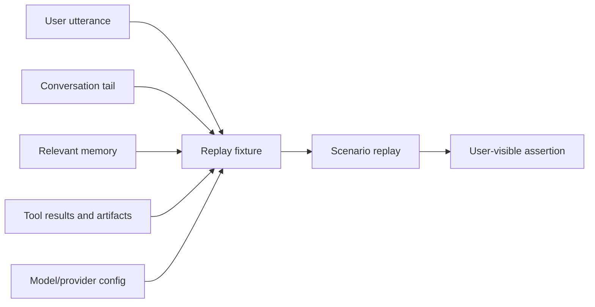

# Trace Replay Is the Missing Test Layer for Agents

> Unit tests prove a function works. Trace replay proves the agent still behaves when the real conversation, memory, tools, and final artifact all collide.

The bug looked unfair at first. A developer ran several PPT generation tests. The local logic passed. The export path looked fine. The prompt told the agent to produce a `.pptx`.

Then a real user got a PDF.

Nothing in the small test suite failed because the test suite was checking the developer's imagined path. It did not replay the user's exact wording. It did not include the old conversation state. It did not include the memory that biased the design. It did not check the final user-visible artifact after the tool chain finished.

That is the difference between testing an agent component and testing an agent capability.

The thesis is blunt:

> Every serious agent bug should leave behind a replayable trace, or the fix is only a story.

---

## The Failure Mode: Happy-Path Tests Lie Politely

Most teams start with tests like these:

- Does the function parse the tool call?
- Does the exporter create a file?
- Does the router select a model?
- Does memory retrieval return something?

Those tests are useful. They are not enough.

Agent failures are composition failures. The wrong result often appears only after several correct subsystems interact.

| Layer | Local test says | Real trace reveals |
|---|---|---|
| Prompt | Instruction mentions `.pptx` | The agent still chooses a PDF preview path after a subtask |
| Tool | Export function works | The final response links the wrong artifact |
| Memory | Preference retrieval returns relevant rows | A stale preference overrides the current scene |
| Model adapter | API call succeeds | Provider-specific fields break only for one model family |
| UI trace | Task completed | The user never receives the requested deliverable |

The system did not need one more assertion. It needed a test that replayed the same situation that hurt the user.

---

## What a Trace Must Capture

A useful trace is not a log dump. It is the minimum executable evidence needed to recreate the decision environment.

The replay fixture should include the user wording, the prior turns that change meaning, the memory rows that could influence the answer, the tool outputs that drive branching, and the expected final result.

The expected result should be stated at the same level the user experiences. For a file task, the assertion is not "exporter called." It is "the final delivered file exists, is a `.pptx`, is reachable from the response, and is not replaced by a PDF preview."

---

## The Replay Ladder

Not every trace needs a full production environment. Use the smallest layer that can reproduce the failure.

| Level | Use when | Example assertion |
|---|---|---|
| Fixture replay | The bug is in routing, prompt assembly, or validation | Given this conversation, selected deliverable type is `.pptx` |
| Tool-chain replay | The bug depends on actual tool side effects | File is created, converted, attached, and referenced correctly |
| Browser/API replay | The bug appears in UI, network, or external integration | Trace page shows the expected artifact and no 4xx/5xx |
| Production-near replay | The bug depends on memory, provider, and long conversation state | Same user scenario finishes with the same observable result |

The rule is not "always run the heaviest test." The rule is "do not stop below the layer where the bug was born."

---

## Evidence: The Test Should Kill the Old Bug

A replay test earns its keep only when it would have failed before the fix. For agent work, that often means asserting the negative path:

- The response must not attach a preview artifact as the final deliverable.
- A stale memory must not override an explicit current request.
- A provider-specific reasoning field must not be sent back in a way the provider rejects.
- A retry loop must stop and explain the blocker instead of repeating the same failed command.
- A browser automation task must verify the DOM or screenshot, not merely claim navigation happened.

This turns a user complaint into a permanent system boundary. The next developer does not need to remember the incident. The test remembers it.

---

## Boundaries and Cost

Trace replay can become expensive if every regression requires the full stack. The way out is to extract the decision boundary.

If a bad memory selection caused the failure, replay memory selection with the real memory rows. If final delivery failed, replay the artifact pipeline. If model streaming broke after the first token, replay the adapter behavior. Keep one or two end-to-end tests for the full path, but move most scenarios into deterministic fixtures.

The goal is not theatrical realism. The goal is faithful causality.

---

## Design Rules

- Every user-visible agent regression should become a named scenario.
- The scenario must include real wording, relevant prior state, memory influence, tool side effects, and the final user-visible result.
- The assertion should target the user's outcome, not an internal function call.
- If the fix only changes a prompt, the replay should prove that the prompt now constrains behavior across wording variants.
- If the same class of issue appears twice, stop adding local patches and move the boundary into schema, validation, or a hard gate.

Agent testing matures when bugs stop becoming anecdotes and start becoming replayable contracts.
