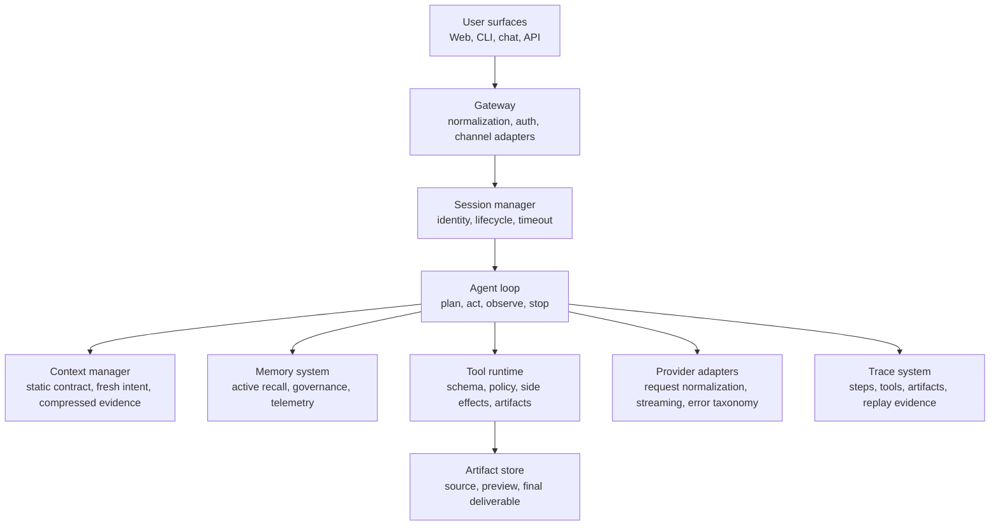
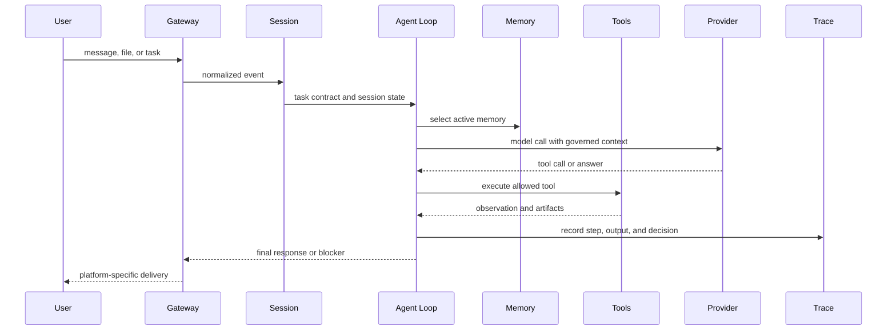

# Field Guide: Agent Control-Plane Architecture

> A production agent is not a model wrapper. It is a control plane for intent, authority, memory, tools, artifacts, and proof.

This guide describes a reusable architecture pattern for agents that must do work with side effects. AgentClaw is one implementation example, but the pattern is broader: separate the model's cognitive role from the system responsibilities that make work safe, repeatable, and deliverable.

## Thesis

> A useful agent framework separates cognition from authority.

The model can propose actions and interpret observations. It should not own persistence, permissions, delivery, provider compatibility, channel semantics, or release discipline. Those are system boundaries.

## High-Level Shape

The diagram is intentionally layered. A failure should have a home: stale preference belongs in memory governance, provider incompatibility belongs in an adapter, a missing final file belongs in the artifact pipeline, and repeated action belongs in loop control.

## Core Boundaries

| Boundary | Owned by | Why it matters |
|---|---|---|
| User/channel normalization | Gateway and adapters | Prevents web, chat, and desktop from becoming different agents |
| Task lifecycle | Session manager and agent loop | Stops long-running work from becoming invisible or immortal |
| Context influence | Context manager | Keeps fresh user intent stronger than stale history |
| Memory authority | Memory system | Prevents old preferences from becoming unreviewed policy |
| Tool execution | Tool runtime and policy | Keeps the model from directly owning side effects |
| Provider behavior | Provider adapters | Hides model-family quirks behind normalized contracts |
| Artifact delivery | Artifact pipeline | Ensures the user receives the requested file or result |
| Evidence | Trace system | Makes failures replayable instead of anecdotal |

## Data Flow

Trace capture is part of the flow, not a logging afterthought. If the final result fails, the team needs enough evidence to replay the path at the layer where the failure occurred.

## Reliability Mechanisms

| Mechanism | Failure it addresses |
|---|---|
| Iteration budgets and duplicate detection | Agents repeating actions without progress |
| Tool schemas and policy gates | Ambiguous or unsafe model-selected actions |
| Context compression with protected recent tail | Old evidence overriding current user intent |
| Active memory selection | Irrelevant memory polluting decisions |
| Provider adapters | Model-specific request and streaming incompatibilities |
| Delivery contracts | Preview artifacts replacing requested final outputs |
| Scenario replay | Fixes that pass local tests but fail real user paths |

## Field Evidence

AgentClaw's implementation record is useful here as a case study, not as a requirement. Its failures around file delivery, memory influence, provider compatibility, and trace replay point to the same architectural conclusion: the model can be strong and the system can still fail if authority, evidence, and final delivery are not owned outside the prompt.

The transferable lesson is to assign each class of failure to a deterministic boundary. Prompt instructions can explain the policy, but code, schemas, stores, adapters, and tests have to enforce it.

## Deployment Boundary

Draw the deployment boundary around the runtime that owns sessions and tool execution. High-authority tools should be sandboxed or constrained by policy. Generated artifacts should be stored where the delivery channel can actually reach them. Provider configuration, memory migrations, and trace retention are production dependencies, not optional plugins.

## What This Architecture Optimizes For

This architecture optimizes for finishing real tasks under changing context: long conversations, memory, file delivery, browser work, multiple channels, and provider variability. It does not optimize for being the smallest possible chat wrapper.

The trade-off is more system surface area. The payoff is failure isolation. When each responsibility has a boundary, fixes become architectural instead of conversational.

## Principle

The model should be powerful inside the loop, but the system must own the loop's authority, memory, and proof of completion.
