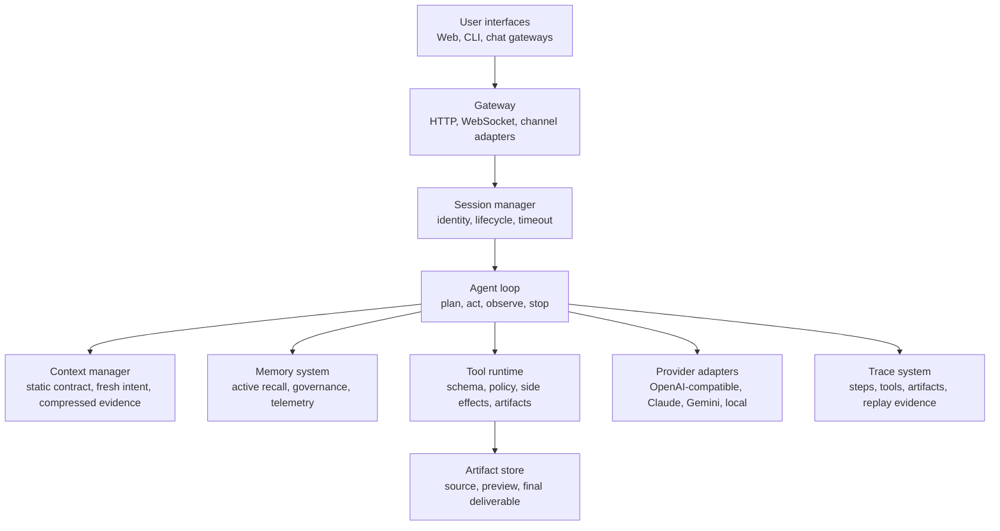
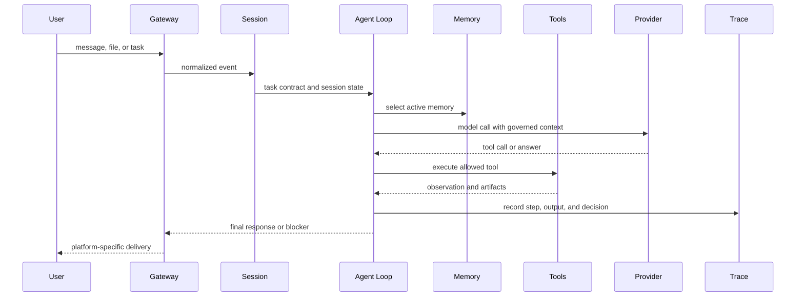

# AgentClaw Architecture

> AgentClaw is an agent control plane: it turns user intent into governed loops, tool actions, memory reads, artifact delivery, and traceable outcomes.

The architecture exists because a production agent cannot be only a model wrapper. The model proposes actions. The system decides what authority those actions have, what context the model receives, how tools are executed, how memory is allowed to influence decisions, and whether the final result is actually delivered.

## Thesis

> A useful agent framework separates cognition from authority.

The model should not own persistence, permissions, delivery, provider compatibility, channel semantics, or release discipline. Those are system responsibilities.

## High-Level Shape

## Core Boundaries

| Boundary | Owned by | Why it matters |
|---|---|---|
| User/channel normalization | Gateway and adapters | Prevents Telegram, web, and desktop from becoming different agents |
| Task lifecycle | Session manager and agent loop | Stops long-running work from becoming invisible or immortal |
| Context influence | Context manager | Keeps fresh user intent stronger than stale history |
| Memory authority | Memory system | Prevents old preferences from becoming unreviewed policy |
| Tool execution | Tool runtime and policy | Keeps the model from directly owning side effects |
| Provider behavior | Provider adapters | Hides model-family quirks behind normalized contracts |
| Artifact delivery | Artifact pipeline | Ensures the user receives the requested file or result |
| Evidence | Trace system | Makes failures replayable instead of anecdotal |

## Data Flow

The trace is not an afterthought. It is written throughout the flow so a production failure can be replayed at the right layer later.

## Reliability Mechanisms

| Mechanism | Failure it addresses |
|---|---|
| Iteration budgets and duplicate detection | Agents repeating actions without progress |
| Tool schemas and policy gates | Ambiguous or unsafe model-selected actions |
| Context compression with protected recent tail | Old evidence overriding current user intent |
| Active memory selection | Irrelevant memory polluting decisions |
| Provider adapters | Model-specific request and streaming incompatibilities |
| Delivery contracts | Preview artifacts replacing requested final outputs |
| Scenario replay | Fixes that pass local tests but fail real user paths |

## Deployment Shape

AgentClaw is a TypeScript monorepo with a web control plane, gateway surfaces, core agent runtime, tools, memory, and integrations. The deployment boundary should be drawn around the runtime that owns user sessions and tool execution. High-authority tools should be sandboxed or constrained by policy. Generated artifacts should be stored where the delivery channel can actually reach them.

## What This Architecture Optimizes For

AgentClaw optimizes for finishing real tasks under changing context: long conversations, memory, file delivery, browser work, multiple channels, and provider variability. It does not optimize for being the smallest possible chat wrapper.

The trade-off is more system surface area. The payoff is that failures can be isolated: a provider bug belongs in the adapter, a stale preference belongs in memory governance, a wrong file belongs in delivery gates, and a repeated action belongs in loop control.

## Principle

The model should be powerful inside the loop, but the system must own the loop's authority, memory, and proof of completion.
